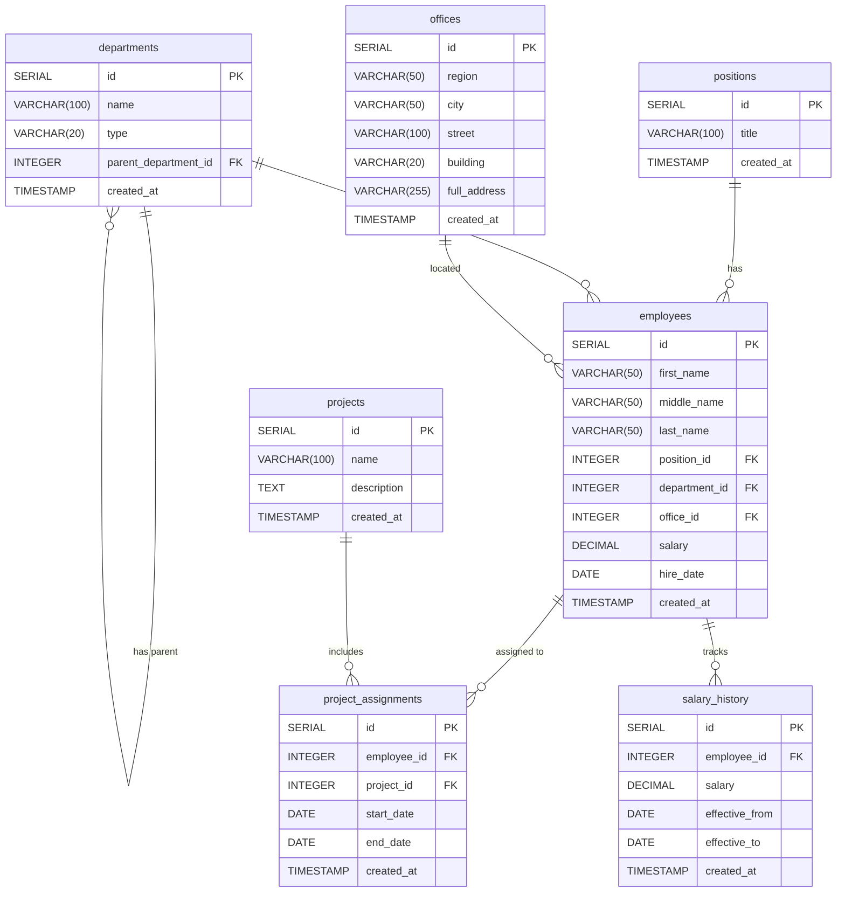

# Домашнее задание к занятию «Базы данных»

https://github.com/netology-code/sdb-homeworks/blob/main/12-01.md

---

## Вводные данные

* [файл в формате csv](hw-12-1.csv), в котором сформирован отчёт.
  - N.B.: оригинальный файл содержал некий "контент" и "подключения к источникам данных", нам этого тут не надо

## Задание 1

> Опишите не менее семи таблиц, из которых состоит база данных
>
> - какие данные хранятся в этих таблицах,
> - какой тип данных у столбцов в этих таблицах, если данные хранятся в PostgreSQL.
>
> Начертите схему полученной модели данных. Можете использовать онлайн-редактор: https://app.diagrams.net/

Выполнение:
1.	Внимательно изучите предоставленный вам файл с данными и подумайте, как можно сгруппировать данные по смыслу. ✅
2.	Разбейте исходный файл на несколько таблиц и определите список столбцов в каждой из них. ✅
3.	Для каждого столбца подберите подходящий тип данных из PostgreSQL. ✅
4.	Для каждой таблицы определите первичный ключ (PRIMARY KEY).✅

### департаменты - departments
Хранит информацию о департаментах компании и их классификацию
```sql
CREATE TABLE departments (
    id SERIAL PRIMARY KEY,
    name VARCHAR(100) NOT NULL,
    type VARCHAR(20) NOT NULL CHECK (type IN ('Отдел', 'Группа', 'Департамент')),
    parent_department_id INTEGER REFERENCES departments(id),
    created_at TIMESTAMP WITH TIME ZONE DEFAULT CURRENT_TIMESTAMP
);
```

### офисы - offices
Хранит ниформацию об офисах и их местоположении
```sql
CREATE TABLE offices (
    id SERIAL PRIMARY KEY,
    region VARCHAR(50) NOT NULL,
    city VARCHAR(50) NOT NULL,
    street VARCHAR(100) NOT NULL,
    building VARCHAR(20) NOT NULL,
    full_address VARCHAR(255) NOT NULL,
    created_at TIMESTAMP WITH TIME ZONE DEFAULT CURRENT_TIMESTAMP,
    UNIQUE (region, city, street, building)
);
```

### должности - positions
Хранит информацию о должностях сотрудников в компании
```sql
CREATE TABLE positions (
    id SERIAL PRIMARY KEY,
    title VARCHAR(100) NOT NULL UNIQUE,
    created_at TIMESTAMP WITH TIME ZONE DEFAULT CURRENT_TIMESTAMP
);
```

### сотрудники - employees
Хранит информацию о сотрудниках, указатели на должности, отделы, офисы
```sql
CREATE TABLE employees (
    id SERIAL PRIMARY KEY,
    first_name VARCHAR(50) NOT NULL,
    middle_name VARCHAR(50),
    last_name VARCHAR(50) NOT NULL,
    position_id INTEGER NOT NULL REFERENCES positions(id),
    department_id INTEGER NOT NULL REFERENCES departments(id),
    office_id INTEGER NOT NULL REFERENCES offices(id),
    salary DECIMAL(10,2) NOT NULL CHECK (salary >= 0),
    hire_date DATE NOT NULL,
    created_at TIMESTAMP WITH TIME ZONE DEFAULT CURRENT_TIMESTAMP
);
```

### проекты - projects
Хранит информацию о проектах
```sql
CREATE TABLE projects (
    id SERIAL PRIMARY KEY,
    name VARCHAR(100) NOT NULL UNIQUE,
    description TEXT,
    created_at TIMESTAMP WITH TIME ZONE DEFAULT CURRENT_TIMESTAMP
);
```

### команды проектов - project_assignments
Связывает сотрудников с проектами
```sql
CREATE TABLE project_assignments (
    id SERIAL PRIMARY KEY,
    employee_id INTEGER NOT NULL REFERENCES employees(id),
    project_id INTEGER NOT NULL REFERENCES projects(id),
    start_date DATE NOT NULL DEFAULT CURRENT_DATE,
    end_date DATE,
    created_at TIMESTAMP WITH TIME ZONE DEFAULT CURRENT_TIMESTAMP,
    UNIQUE (employee_id, project_id, start_date)
);
```

### зарплатная история - salary_history
Эвент-таблица окладов, поскольку оклады меняются во времени хранить только текущий бесполезно.

```sql
CREATE TABLE salary_history (
    id SERIAL PRIMARY KEY,
    employee_id INTEGER NOT NULL REFERENCES employees(id),
    salary DECIMAL(10,2) NOT NULL CHECK (salary >= 0),
    effective_from DATE NOT NULL,
    effective_to DATE,
    created_at TIMESTAMP WITH TIME ZONE DEFAULT CURRENT_TIMESTAMP
);
```


5.	Определите типы связей между таблицами. ✅

- `departments.parent_department_id` → `departments.id` (указатель внутри таблицы позволяет смоделировать иерархию отделов)
- `employees.position_id` → `positions.id`
- `employees.department_id` → `departments.id`
- `employees.office_id` → `offices.id`
- `project_assignments.employee_id` → `employees.id`
- `project_assignments.project_id` → `projects.id`
- `salary_history.employee_id` → `employees.id`

6.	Начертите схему модели данных. ✅


**Результат** 

>должен стать скриншот получившейся схемы базы данных.

попробуем силами расширений маркдауна:


